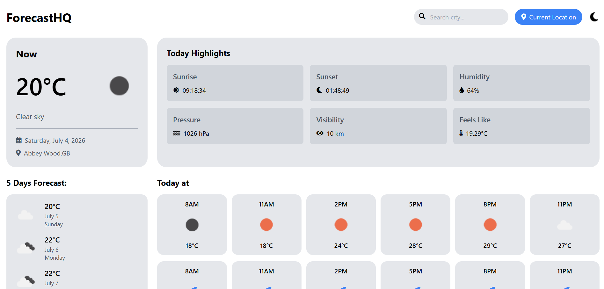

# ForecastHQ

[](https://react.dev/)
[](https://tailwindcss.com/)
[](https://axios-http.com/)
[](https://openweathermap.org/api)
[](https://opensource.org/licenses/MIT)

**ForecastHQ** is a premium, fully responsive weather forecasting dashboard application. It provides real-time atmospheric updates, dynamic geocoding, multi-day forecasts, and hourly weather projections wrapped in a sleek, transition-fluid interface featuring dark and light modes.

---

## 📸 Application Preview

Below is a preview of the ForecastHQ interface in action, displaying the clean grid layout, highlight metrics, and forecast trends:

<p align="center">
  
</p>

---

## ✨ Features

- **Smart Geolocation Detection**: Instantly load local weather using the browser's native `navigator.geolocation` API combined with reverse geocoding to identify your city name.
- **Interactive City Autocomplete**: Dynamic search capabilities with instant city, state, and country predictions using the OpenWeatherMap Geocoding API.
- **Search Query Debouncing**: Optimized API usage with a 400ms typing delay buffer to avoid redundant or duplicate geocoding request calls.
- **Input Sanitization & Encoding**: Robust security layer that scrubs malicious characters and URL-encodes queries prior to API delivery to prevent cross-site scripting (XSS) and injection vulnerabilities.
- **Ambient Theme Toggle**: Swap seamlessly between a premium dark theme (`#101014`) and a clean, high-contrast light theme with micro-animations.
- **Comprehensive Weather Highlights**: Detailed metrics card detailing Sunrise/Sunset times, Humidity, Atmospheric Pressure, Visibility index, and Feels-like temperature.
- **Hourly Forecasting Grid**: Clear 24-hour horizontal breakdowns depicting hourly temperature shifts and corresponding weather conditions.
- **Hourly Wind Tracker**: Interactive wind velocity index tracking wind speed and directional flow.
- **5-Day Extended Forecast**: Long-range meteorological forecast detailing daily peak temperatures and dates.
- **Mobile-First Responsive Layout**: Built with a responsive CSS grid system that scales smoothly from smartphones to desktop screens.

---

## 🛠️ Tech Stack & Dependencies

- **Framework**: [React](https://reactjs.org/) (v18.3.1)
- **Styling & Layout**: [Tailwind CSS](https://tailwindcss.com/) (CDN utility compilation) & Custom CSS
- **HTTP Client**: [Axios](https://github.com/axios/axios) for promise-based API fetching
- **Icons**: [FontAwesome Icons](https://fontawesome.com/) & [Icons8](https://icons8.com/)

---

## 📁 Repository Structure

```filepath
ForecastHQ/
├── public/
│   ├── forecasthq1.png      # Application screenshot
│   ├── favicon.ico          # Browser tab icon
│   └── index.html           # Main template loading Tailwind and FontAwesome
├── src/
│   ├── Components/
│   │   ├── WeatherDashboard.js  # Main application dashboard logic and UI layout
│   │   ├── WeatherDashboard.css # Dashboard styling rules
│   │   └── icons8-light-mode-78.png
│   ├── App.js               # Entry Component
│   ├── index.js             # ReactDOM renderer
│   └── index.css            # Base stylesheet
├── package.json             # Manifest of project dependencies
└── README.md                # Project documentation (You are here)
```

---

## 🔌 API Endpoints Integration

ForecastHQ leverages the **OpenWeatherMap API** to deliver seamless, real-time weather analytics. The following endpoints are integrated:

| Endpoint | Purpose | API Query |
| :--- | :--- | :--- |
| **Current Weather** | Fetches the current temperature, conditions, sunrise/sunset times, and atmospheric details. | `/data/2.5/weather` |
| **5-Day Forecast** | Retrieves meteorological data in 3-hour intervals for constructing the daily and hourly forecasts. | `/data/2.5/forecast` |
| **Geocoding API** | Provides search suggestions and coordinates based on text typed in the search field. | `/geo/1.0/direct` |
| **Reverse Geocoding** | Translates coordinate coordinates (latitude/longitude) back into readable city and country names. | `/data/2.5/reverse` |

---

## 🚀 Getting Started

Follow these steps to run the application locally on your computer:

### 1. Prerequisites
Ensure you have **Node.js** (v16.x or newer) and **npm** installed on your system.

### 2. Clone the Repository
```bash
git clone https://github.com/your-username/ForecastHQ.git
cd ForecastHQ
```

### 3. Install Dependencies
```bash
npm install
```

### 4. Configure Your API Key
In the current implementation, the API key is hardcoded directly in `src/Components/WeatherDashboard.js` on line 17:
```javascript
const API_KEY = 'YOUR_OPENWEATHERMAP_API_KEY';
```
Create a free account on [OpenWeatherMap](https://openweathermap.org/) to obtain your custom API key and insert it here.

### 5. Run the Application
Launch the local webpack development server:
```bash
npm start
```
Open [http://localhost:3000](http://localhost:3000) to view the application inside your web browser.

---

## 📄 License

Distributed under the MIT License. See [LICENSE](LICENSE) for more information.

---

<p align="center">Made with ❤️ for premium forecasting experiences.</p>
